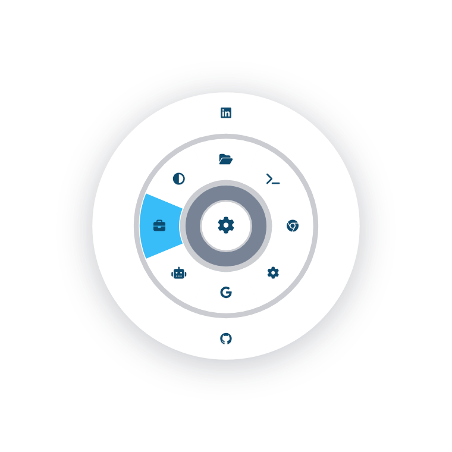

# Radial

A high-performance, transparent radial concentric menu for app launching and navigation. Built with Electron, Vite, and SVG, it features a unique "always-on-top" design and smooth expansion animations.



## Key Features

- **Concentric Ring Expansion**: A multi-level radial menu that expands and collapses with smooth SVG animations.
- **Always-on-Top & Transparent**: Frameless window that stays above other applications while maintaining a clean, distraction-free aesthetic.
- **Draggable Handle**: A dedicated, opaque center handle for repositioning the window.
- **OS Settings Integration**: One-click access to native OS settings across Linux, Windows, and macOS.
- **GPU Stable on Linux**: Specifically tuned to disable hardware acceleration to prevent crashes on Wayland and X11 environments.
- **Theme Support**: Light, Dark, and Auto (system sync) modes.

## Technical Stack

- **Framework**: [Electron](https://www.electronjs.org/)
- **Build Tool**: [Vite](https://vitejs.dev/)
- **Styling**: Tailwind CSS 4.0 + FontAwesome 6
- **Graphics**: Dynamic SVG generation with CSS-driven animations

## Installation & Development

### Prerequisites

- Node.js (v20+)
- npm

### Setup

```bash
# Install dependencies
npm install

# Run in development mode
npm run dev
```

### Build

```bash
# Build for production
npm run build

# Create platform-specific distributable
npm run dist-linux
# or dist-mac / dist-win
```

## Configuration

The menu structure is defined in `src/renderer/menu-config.ts`. You can customize icons, labels, commands, and URLs.

### Default Controls

- **Center Disc**: Drag to move the window.
- **Trigger Ring (Inner-most)**: Click to toggle the root menu.
- **Wedges**: Click to execute a command, open a URL, or navigate into a sub-menu.
- **Escape**: Back one level / Collapse menu / Quit application.
- **Background Click**: Collapse the menu to center.

## One-shot prompt

To recreate this optimized implementation, use the following prompt:

> Create a high-performance Electron application called "Radial" that provides a transparent, concentric radial menu. The application should use Vite for the build process, TypeScript for logic, and Tailwind CSS 4.0 for styling. 
> 
> **Key Requirements:**
> 1. **Electron Main Process:**
- Create a frameless, transparent, "always-on-top" window.
- Set the application icon using `icons/radial512x512.png`.
- Handle application launching for common tools (Files, Terminal, Browser, Settings) across Linux, Windows, and macOS.

>    - Disable hardware acceleration on Linux for stability.
>    - Ensure only a single instance of the app runs.
> 
> 2. **Renderer UI (SVG-based):**
>    - Implement a radial menu using dynamic SVG generation.
>    - The menu should have a central draggable disc for moving the window.
>    - An inner "Trigger Ring" toggles the root menu expansion.
>    - Menu items should be arranged in concentric rings that expand and collapse with smooth CSS animations (`stroke-width` transitions).
>    - Support nested sub-menus (breadcrumbs) where selecting a folder opens a new outer ring.
>    - Use FontAwesome 6 icons for menu items.
>    - Implement a theme system (Light/Dark/Auto) stored in localStorage.
> 
> 3. **Architecture:**
>    - Separate menu configuration (items, icons, commands) into a dedicated `menu-config.ts` file.
>    - Use a preload script to safely expose Electron IPC methods (launch, quit, hide, openUrl) to the renderer.
>    - Optimize rendering by using an efficient state-to-DOM update loop.
> 
> 4. **UX & Interactions:**
- Clicking a command or URL should collapse the menu and quit the application.
- The `Escape` key should navigate back, collapse the menu, or quit the application sequentially.
- Clicking the transparent area around the menu should collapse the menu.
>    - Use smooth CSS transitions (180ms - 500ms) for all interactions.

## License

MIT
